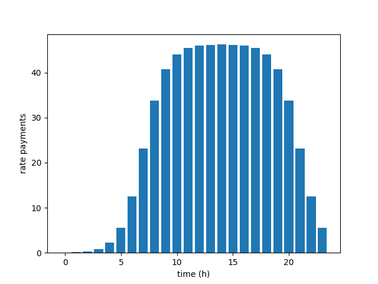

# Credit Card Fraud Simulation using a Non-homogeneous Poisson Process 

## Intro
The File **simulation.py** contains all classes necessaries for the simulation.
They are:
+ **simulationAssumptions**:
    It handle all assumptions made for the simulation
+ **nonhomogeneous_PoissonProcess**:
    The class responsible for generating arriving times from a non-homogeneous
    Poisson Process
+ **clients**:
    a class taking care of all clients' info
+ **stores**:
    a class taking care of all stores' info
+ **fraudSimulation**:
    the main class responsible to tie all classes together to run the simulation.

Below I explain the mathematical assumptions made for me to perform the simulation

## The simulation model

Consider a city 

    C = B[0, R'] ⊂ R2 ,

with B[0, R'] the closed ball under the norm

    |x| = max {x1, x2}.

Such city has a population of **N** clients, a population
of **N1** stores of type 1 and, finally, a population of
**N2** stores of type 2. Here a store is said to be of type 1 or 2
if
* store of type 1 ⇔ the store sells essential goods such as food, gas, ...
* store of type 2 ⇔ the store sells nonessential goods such as eletronic gadgets,
    toys, etc.

To fix the idea, lets assume the case with only one person in the city, as 
depicted in the Figure below.

    

Let, _Tn_, from a nonhomogeneous Poisson Process where for each
time _Tn_, the index _n_ is related to
1. a client trying to buy a product of type 0 with his credit card.
   Such event happens  with probability p0;
2. a client trying to buy a product of type 1 with his credit card.
   Such event happens  with probability p1;
3. a thief trying to buy a product of type 0 or 1 with a false credit card.
   Such event happens  with probability p2;

(constraint p0 + p1 + p2 == 1)

At the end of the simulation we have a sequence _S0_, _S1_, _S2_, ..., of random
variables, saved in a csv file.  The csv's rows represent
the times a credit card was used and the columns represent the main data
desired. The column atributes are:
* **clientID**: client's ID;
* **buyID**: number identificating the credit card payment;
* **time**: time when the payment was done;
* **moneySpent**: amount of money spent;
* **shop accepted**: a boolean value where _True_ means payment accepted anf _FALSE_
    otherwise;
* **was a fraud**: a boolean value where _True_ means the payment attempt was comming 
     from a fraud and _FALSE_ otherwise;
* **store bought from**: the ID of the store where the credit card was used;
* **type product**: type of the product bought;
* **place where cc was used x**: x coordinate of the store's place
* **place where cc was used y**: y coordinate of the store's place

## How the simulation works

Let _Tn_ be a sequence of iterarrival times from a nonhomogeneous 
Poisson Process with intensity function I(t). The intensity function will
measure the rate of payments in the period of one day and
the one used by me is a mix of the amount of clients in the 
simulation and a probability density function. For an amount of 20000 clients,
it looks like this

## Assumptions for the simulation
The assumptions are listed down below
1. A client can only buy two kinds of products, called 'essential goods' and 
   'nonessential goods'. 'Essential goods' are products related with products
   considered essential for living, such as food, refueling, restaurants, ...
   Meanwile, 'Nonessential goods' are products like eletronic devices, toys,...
   I just set these two categories for the simulation in order to have a better
   control on how each client would spend his money;
2. A credit card payment will be flaged 
    * 'essential' with probability
2. The probabilities for the categorical values 'essential good', 'nonessential
   good' and 'fraud' are
