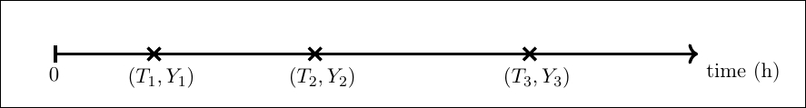

# Credit Card Fraud Simulation using a Non-homogeneous Poisson Process 

## Intro
The File **simulation.py** contains all classes necessaries for the simulation.
They are:
+ **simulationAssumptions**:
    It handle all assumptions made for the simulation
+ **nonhomogeneous_PoissonProcess**:
    The class responsible for generating arriving times from a non-homogeneous
    Poisson Process
+ **clients**:
    a class taking care of all clients' info
+ **stores**:
    a class taking care of all stores' info
+ **fraudSimulation**:
    the main class responsible to tie all classes together to run the simulation.

Below I explain the mathematical assumptions made for me to perform the simulation

## The simulation model

Consider a city 
<div align='center'>
    C = B[0, R'] ⊂ R<sup>2</sup> ,
</div>
with B[0, R'] the closed ball under the norm
<div align='center'>
    |x| = max {x<sub>1</sub>, x<sub>2</sub>}.
</div>

Such city has a population of **N** clients, a population
of **N<sub>1</sub>** stores of type 1 and, finally, a population of
**N<sub>2</sub>** stores of type 2. Here a store is said to be of type 1 or 2
if
* store of type 1 ⇔ the store sells essential goods such as food, gas, ...
* store of type 2 ⇔ the store sells nonessential goods such as eletronic gadgets,
    toys, etc.

To fix the idea, lets assume the case with only one person in the city, as 
depicted in the Figure below.

<div align='center'>
    
</div>

Each person has one house whose position is allocated randomily at the city.
Also, it is supposed that there
is a radius _R_ > 0 where the person is more likely to be from his/her home.
At the same way, stores of type 1 and 2 have their localisation allocated
randomily throughout the city.

Now we need to attach the events of payments into this model.
This is done with the assistance of the nonhomogeneous Poisson Process.

Let _T<sub>n</sub>_ be the time of the _nth_ payment using a credit card (following,
as already said, a nonhomogeneous Poisson Process).

<div align='center'>
    
</div>

At each time _T<sub>n</sub>_ we mark with a multinomial random variable _Y<sub>n</sub>_
(iid from all others random variables).
The random variable _Y<sub>n</sub>_ is equivalent to tossing a coin whose values
can be either
1. the nth payment is referent to a  product of type 0.
   Such event happens  with probability p0;
2. or the nth payment is referent to a  product of type 1.
   Such event happens  with probability p1;
3. or a thief is trying to buy a product of type 0 or 1 with a false credit card.
   Such event happens  with probability p2;

(constraint p0 + p1 + p2 == 1)

Finally, the simulation happens in the following manner
1. wait for a payment time _T<sub>n</sub> with a credit card;
2. toss a coin _Y<sub>n</sub>_;
3. if the coin is not equal to a fraud then
    1. choose randomily a position to a person _X_. This person
       _X_ is, also, choosen randomily, and the likelihood of being
       chosen is in function of his/her credit card limit for the month;
    2. choose randomily what kind of product the person _X_ is going
       to buy. It can be an essentiall good or nonessential;
    3. After choosing the type of product the person will choose a store
       that has a better price and is not that far away from _X_.
       In the end, the choise is reduced to a minimization problem
       where the loss function has as parameters price and distance;
    4. Now if the payment doesn't surpass the person's credit card limit
       then the payment will be tagged as accepted. In case contrary it will
       be denied the payment and it will be flagged as not accepted.
4. if the coin is equal to a fraud then
    1. choose randomily a position and a person _X_. This person
       _X_ will have his/her credit card used for the fraud
    2. choose randomily what kind of product  is going
       to buy buy the thieve. It can be an essentiall good or nonessential;
    3. Now if the payment doesn't surpass the person's credit card limit
       then the payment will be tagged as accepted. In case contrary it will
       be denied the payment and it will be flagged as not accepted;
    4. Many more attempts of payments will be done with the same credit 
       card in a small range of time. Such time is given by a geometric
       distribution with low probabilty;
    5. All fraud payments are flagged as fraud;
5. Continue this process untill the period of time under study is over.


## The outcome of the simulation

At the end of the simulation we have a sequence _S0_, _S1_, _S2_, ..., of random
variables, saved in a csv file.  The csv's rows represent
the times a credit card was used and the columns represent the main data
desired. The column atributes are:
* **clientID**: client's ID;
* **buyID**: number identificating the credit card payment;
* **time**: time when the payment was done;
* **moneySpent**: amount of money spent;
* **shop accepted**: a boolean value where _True_ means payment accepted anf _FALSE_
    otherwise;
* **was a fraud**: a boolean value where _True_ means the payment attempt was comming 
     from a fraud and _FALSE_ otherwise;
* **store bought from**: the ID of the store where the credit card was used;
* **type product**: type of the product bought;
* **place where cc was used x**: x coordinate of the store's place
* **place where cc was used y**: y coordinate of the store's place

## How to run the simulation
Given the situation
* A city of radius R = 10000km;
* A population of 1000 clients;
* An amount of 100 stores (summing the ones of type 0 and 1);
* A period of 360 days;

We must run at python3
```
from simulation import *
simulation = fraudSimulation(amount_of_days  = 360,
                             clientsPopSize  = 1_000,
                             storesPopSize   = 100,
                             ball_radius_R   = 10_000)
simulation.runSim()
simulation.print_to_csv('sim.dat')
```

Then the file _sim.dat_ will have the results of the simulation.

## An example of outcome
Setting
```
simulation = fraudSimulation(amount_of_days  = 360 * 5,
                             clientsPopSize  = 10_000,
                             storesPopSize   = 2_000,
                             ball_radius_R   = 80_000)
```

We ended with the following time series
<div align='center'>
    
    
</div>

## Assumptions

### Intensity function

The intensity function for the nonhomogeneous Poisson Process will
measure the rate of payments in the period of one day.

The one used by me is a mix of the amount of clients in the 
simulation and a probability density function. 
For an amount of 20000 clients,
it looks like this

<div align='center'>
    
</div>

